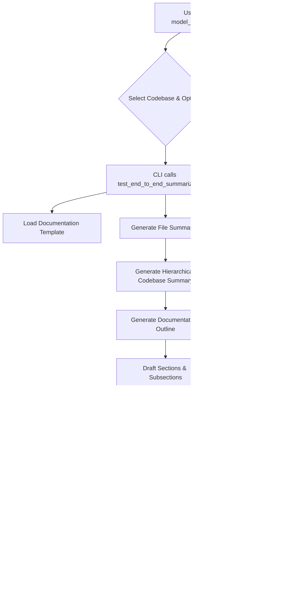

# Technical Documentation: Model Documentation Agent

## 1. Introduction

### 1.1. Purpose
The Model Documentation Agent is a Python-based system designed to automate the generation of comprehensive technical documentation for software codebases, with a particular focus on financial models. Its primary goal is to reduce the manual effort involved in documentation by leveraging Large Language Models (LLMs) to analyze code, extract relevant information, and synthesize it into a structured, human-readable format.

### 1.2. High-Level Architecture
The system operates through a command-line interface (CLI) that orchestrates a multi-step process. This process involves:
1.  Loading and parsing a target codebase.
2.  Utilizing an LLM (specifically, models from Anthropic's Claude family) to generate summaries of individual code files and a hierarchical overview of the codebase.
3.  Using these summaries and a predefined documentation template to generate an outline for the final document.
4.  Drafting each section and subsection of the documentation based on the outline and code summaries, again using LLM-generated content.
5.  Assembling these drafted sections into a coherent final Markdown document.

The system is designed to be modular, with distinct components for codebase interaction, LLM communication, prompt engineering, configuration management, and output generation.

### 1.3. Core Technologies
-   **Python 3**: The primary programming language.
-   **Large Language Models (LLMs)**: Anthropic's Claude models (e.g., Haiku, Sonnet, Opus) are used for code understanding and text generation.
-   **Langchain**: While not explicitly detailed in every interaction, Langchain concepts and potentially its library components are foundational for structuring LLM interactions, prompt management, and chaining LLM calls.
-   **JSON**: Used for configuration files, documentation templates, and intermediate data structures.
-   **Markdown**: The format for the final output documentation.

## 2. System Architecture and Workflow

### 2.1. Overall Workflow
The documentation generation process is typically initiated via the `model_doc_agent_cli.py` script.

**Workflow Steps:**
1.  **User Invocation**: The user runs `model_doc_agent_cli.py`.
2.  **Configuration**: The user selects a target codebase (from the `Data/` directory) and monitoring preferences.
3.  **Summarization & Draft Generation (`test_end_to_end_summarization.py`)**:
    *   The documentation template is loaded.
    *   Placeholders for document metadata are prepared.
    *   LLMs are used to generate summaries for each relevant file in the codebase. These are saved individually and as a consolidated text file.
    *   A hierarchical summary of the entire codebase is generated based on file summaries.
    *   A detailed outline for the final documentation is generated, using the template structure and codebase summary as input for an LLM.
    *   Each section and subsection outlined is then drafted by an LLM, using the outline, hierarchical summary, and relevant file summaries as context.
    *   Drafts are temporarily saved as text files for monitoring and then compiled into a comprehensive JSON file (`05_full_documentation.json`).
4.  **Real-time Monitoring**: Throughout the summarization and drafting process, the CLI displays newly generated files and section drafts in the terminal.
5.  **Final Document Assembly (`generate_final_documentation.py`)**:
    *   This script takes the `05_full_documentation.json` and the original documentation template.
    *   It populates the template structure with the LLM-generated content for each section.
    *   The final output is a single Markdown file (`final_documentation.md`).
6.  **Output**: The final document and all intermediate files are saved in a timestamped directory within `output/`.

### 2.2. Key Components/Modules

-   **`model_doc_agent_cli.py`**:
    *   The main user-facing script.
    *   Handles user interaction for codebase selection and options.
    *   Orchestrates the execution of the two main processing scripts.
    *   Manages the real-time monitoring thread.
-   **`test_end_to_end_summarization.py`**:
    *   The core engine for analyzing the codebase and generating draft documentation content.
    *   Interacts heavily with LLMs for summarization, outlining, and drafting.
    *   Implements step-tracking and retry logic for robustness.
-   **`generate_final_documentation.py`**:
    *   Responsible for taking the structured JSON data from the previous step and rendering the final Markdown document based on the template.
-   **`src/` Directory**: Contains the core logic and utilities.
    *   `data/loader.py`: Functions for loading codebase files and documentation templates.
    *   `summarization/engine.py`: Contains the logic for different levels of summarization (e.g., `generate_hierarchical_summary`).
    *   `tools/core_tools.py`: Utility functions, including `summarize_codebase_files` which orchestrates the summarization of all files in a codebase.
    *   `prompts/`: Python modules defining and creating prompts for various LLM tasks (e.g., `base_prompts.py`, `prompt_engineering.py`).
    *   `utils/llm_factory.py`: Centralized factory for creating and configuring LLM (Claude) client instances.
    *   `utils/config.py`: Manages application-level configurations, such as default LLM models and parameters.
-   **`templates/` Directory**: Holds JSON files that define the structure (sections, subsections, IDs, titles) of the output documentation (e.g., `bmo_model_documentation_template.json`).
-   **`output/` Directory**: Stores all generated artifacts from each run, organized into timestamped subdirectories.
-   **`.env` File**: Used for storing sensitive information like the `ANTHROPIC_API_KEY`.
-   **`clean_sensitive_info.py`**: A utility script to remove API keys from specified files.

## 3. Detailed Component Breakdown

### 3.1. `model_doc_agent_cli.py` (CLI Orchestrator)
-   **Purpose**: Serves as the primary entry point for the user. It guides the user through the documentation process and coordinates the execution of backend scripts.
-   **Responsibilities**:
    *   Lists available codebases from the `Data/` directory and prompts the user for selection.
    *   Asks for user preference on displaying individual file summaries during monitoring.
    *   Determines the correct Python executable (system vs. virtual environment).
    *   Constructs and executes command-line calls to `test_end_to_end_summarization.py` and `generate_final_documentation.py`, passing necessary arguments like codebase path and template path.
    *   Initiates and manages a separate thread for `monitor_output_directory`.
-   **Monitoring (`monitor_output_directory`)**:
    *   This function runs in a background thread.
    *   It periodically scans the designated output directory for new or modified files.
    *   When changes are detected, it reads the file content and displays it in the terminal, providing real-time feedback.
    *   It has special formatting for "draft section" files to highlight content generation.
    *   The `show_file_summaries` flag controls whether detailed content from the `02_file_summaries` subdirectory is displayed.
-   **Error Handling**: The CLI includes basic error handling for subprocess execution and provides user-friendly messages. It also ensures the monitoring thread is stopped cleanly on exit or interruption.

### 3.2. `test_end_to_end_summarization.py` (Summarization and Draft Generation Engine)
-   **Purpose**: This is the core script responsible for analyzing the selected codebase and generating all the textual content that will form the basis of the final documentation. It produces a structured JSON file (`05_full_documentation.json`) containing this drafted content.
-   **Step-by-Step Process**:
    1.  **Initialization**:
        *   Creates a timestamped output directory.
        *   Initializes the LLM client using `llm_factory.py`.
        *   Sets up step-tracking variables for error handling and potential retries.
    2.  **Load Template**: Loads the specified JSON documentation template (e.g., `templates/bmo_model_documentation_template.json`). This template defines the sections and subsections of the final document.
    3.  **Prepare Metadata**: Prepares placeholder values for document control metadata (doc ID, version, authors, etc.).
    4.  **Generate File Summaries**:
        *   Calls `summarize_codebase_files` (from `src.tools.core_tools`) which iterates through files in the `codebase_dir`.
        *   For each file, it uses an LLM (via `generate_file_summary` likely within `core_tools` or `summarization.engine`) to produce a summary.
        *   Summaries are saved individually in `output/<run_timestamp>/02_file_summaries/` and consolidated into `02_all_summaries.txt`.
    5.  **Generate Hierarchical Codebase Summary**:
        *   Calls `generate_hierarchical_summary` (from `src.summarization.engine`).
        *   This function takes all the individual file summaries and prompts an LLM to create a higher-level summary that describes the overall structure and purpose of the codebase. Saved to `03_hierarchical_summary.txt`.
    6.  **Generate Documentation Outline**:
        *   Uses `prompt_outline_generation` (from `src.prompts.base_prompts`) to create a prompt.
        *   The prompt is formatted with the documentation template (as a JSON string) and the hierarchical codebase summary.
        *   An LLM generates a detailed outline, which might be a more elaborated version of the template or a JSON structure aligning with it. Saved to `04_documentation_outline.json` (or `.txt` if not valid JSON).
    7.  **Draft Sections and Subsections**:
        *   Iterates through each section and subsection defined in the loaded documentation template.
        *   For each part, it calls `create_section_drafting_prompt` to prepare a specific prompt.
        *   This prompt includes the schema for that specific section/subsection, the overall documentation outline, the hierarchical model summary, and relevant file summaries.
        *   An LLM generates the draft content for that part.
        *   **Dynamic Content**: For specific sections like "Appendix B: Code File Manifest", it can use a different prompt (`prompt_code_manifest_generation`) that directly processes the list of file summaries to create the manifest.
        *   Drafts are written to temporary `.txt` files (e.g., `draft_section_xxx.txt`) in the output directory for real-time monitoring.
        *   The drafted content is then stored in the `full_documentation_draft` Python dictionary.
    8.  **Save Full Documentation JSON**: The `full_documentation_draft` dictionary is saved as `05_full_documentation.json`. This file contains all the generated text, structured according to the template.
    9.  **Generate Summary Report**: Creates a `06_summary_report.json` with metadata about the generation run (timestamp, codebase, files processed, etc.).
-   **Error Handling and Retry Logic**:
    *   The main `run_end_to_end_test` function has a `while` loop for retries (`max_retries`).
    *   It uses a `try-except` block to catch exceptions during the process.
    *   `last_completed_step` variable tracks the last successfully completed major stage. On retry, it attempts to resume from the point of failure (conceptually, though the current implementation mostly re-runs steps if an error occurs within the loop, but re-initializes key data structures for the current attempt).
    *   Identifies "retryable" errors (e.g., API connection issues, rate limits) based on error type strings or messages.
    *   Uses an exponential backoff for `retry_delay`.
    *   If an error is not retryable or retries are exhausted, it logs detailed error information to `error_log.txt` and raises an exception.

### 3.3. `generate_final_documentation.py` (Final Document Assembler)
-   **Purpose**: This script is responsible for the final step: transforming the LLM-generated content (stored in `05_full_documentation.json`) into the final, user-readable Markdown document.
-   **Process**:
    1.  Takes the path to the JSON input directory (e.g., `output/summarization_test_YYYYMMDD_HHMMSS/`) and the path to the documentation template JSON as command-line arguments.
    2.  Reads the `05_full_documentation.json` file to get the drafted content and metadata.
    3.  Reads the documentation template JSON (e.g., `templates/bmo_model_documentation_template.json`) to understand the desired structure.
    4.  Iterates through the sections and subsections defined in the template.
    5.  For each section/subsection, it retrieves the corresponding drafted content from the loaded JSON data.
    6.  It assembles the Markdown content, typically by:
        *   Adding top-level document metadata (title, generation date, codebase path).
        *   Creating a Table of Contents.
        *   Formatting section and subsection titles (e.g., `## 1. Introduction`, `### 1.1. Purpose`).
        *   Injecting the LLM-generated content for each part.
        *   Handling cases where dynamic content for a section might be missing (e.g., the "Content for this section ... was not found" message for the Code File Manifest if generation failed for it).
    7.  Writes the assembled Markdown to `final_documentation.md` within the JSON input directory.

### 3.4. LLM Interaction (`src/utils/llm_factory.py`, `src/prompts/`)
-   **`src/utils/llm_factory.py`**:
    *   Provides a centralized function `create_llm()` to instantiate the Anthropic Claude LLM client.
    *   Takes parameters like model name (e.g., "claude-3-haiku-20240307"), temperature, API key, and mock mode.
    *   Reads default configuration values from `src/utils/config.py`.
    *   This abstraction allows for easier changes to the LLM provider or default settings in one place.
-   **`src/prompts/` Directory (e.g., `base_prompts.py`)**:
    *   This is crucial for effective LLM interaction. It contains Python code that defines and formats prompts for different tasks.
    *   **`prompt_outline_generation`**: A `ChatPromptTemplate` (likely from Langchain) used to guide the LLM in creating the documentation outline. It takes the documentation template structure and the hierarchical codebase summary as input.
    *   **`create_section_drafting_prompt(section_id, section_title)`**: A function that dynamically creates a `ChatPromptTemplate` for drafting a specific section or subsection. It typically takes the schema of that section, the overall outline, the hierarchical summary, and relevant file summaries as input to provide rich context to the LLM.
    *   **`prompt_code_manifest_generation`**: A specialized prompt to generate the "Code File Manifest" appendix by processing the list of file summaries.
    *   Effective prompt engineering here is key to getting high-quality, relevant, and correctly formatted output from the LLM.

### 3.5. Data Handling (`src/data/loader.py`, `Data/` directory)
-   **`src/data/loader.py`**:
    *   `load_template(template_path)`: Reads a JSON documentation template file.
    *   `load_codebase(codebase_dir)`: (Conceptual) This function would be responsible for iterating through files in a given codebase directory, filtering relevant files (e.g., Python files, excluding vendored code or tests if specified), and reading their content. The actual file iteration and summarization initiation seems to be handled more directly within `summarize_codebase_files` in `src/tools/core_tools.py`.
-   **`Data/` Directory**:
    *   This directory is the expected location for all codebases that the user might want to document.
    *   The CLI script scans this directory to present a list of choices to the user.

### 3.6. Configuration (`src/utils/config.py`, `.env`)
-   **`src/utils/config.py`**:
    *   Implements a `Config` class, likely a simple dictionary wrapper or a more sophisticated configuration loader.
    *   Provides default settings for the application, especially LLM parameters like `llm.model_name` and `llm.temperature`.
    *   Allows for centralized management of these settings.
-   **`.env` File**:
    *   Used to store environment-specific variables, primarily the `ANTHROPIC_API_KEY`.
    *   Loaded at runtime (e.g., by `python-dotenv` if used, or directly via `os.environ.get`).
    *   Crucially, this file is included in `.gitignore` to prevent accidental commitment of sensitive API keys.

### 3.7. Output Structure (`output/` directory)
Each run of the agent creates a new subdirectory within `output/`, named with a timestamp (e.g., `summarization_test_YYYYMMDD_HHMMSS`). This directory contains:
-   `01_template.json`: A copy of the documentation template used for the run.
-   `02_all_summaries.txt`: A single text file concatenating all individual file summaries.
-   `02_file_summaries/`: A subdirectory containing individual text files, each being a summary of a specific source code file.
-   `03_hierarchical_summary.txt`: The LLM-generated hierarchical summary of the entire codebase.
-   `04_documentation_outline.json` (or `.txt`): The LLM-generated detailed outline for the documentation.
-   `draft_section_<id>.txt` / `draft_subsection_<id>.txt`: Temporary files created during Step 5 for each drafted section/subsection, used for real-time monitoring.
-   `05_full_documentation.json`: The comprehensive JSON file containing all drafted sections and subsections, along with metadata. This is the primary input for the final document generation step.
-   `06_summary_report.json`: A JSON report with metadata about the generation run.
-   `final_documentation.md`: The final, assembled Markdown documentation.
-   `error_log.txt` (if errors occurred): A detailed log of the last error encountered, including a traceback.

## 4. Error Handling and Retry Mechanisms

The primary error handling and retry logic resides in `test_end_to_end_summarization.py`:
-   **Step Tracking**: The `last_completed_step` variable is used to identify at which stage of the multi-step summarization process an error occurred. While full atomic resumption isn't implemented (i.e., it doesn't save and restore the exact state of all variables), this tracking helps in logging and understanding the point of failure. On a retry attempt, the process generally restarts the LLM calls for the failed and subsequent steps.
-   **Retry Loop**: A `while retry_count <= max_retries` loop allows the script to attempt the entire generation process multiple times if failures occur.
-   **Exception Catching**: A broad `try...except Exception as e` block captures errors.
-   **Retryable Errors**: The system attempts to distinguish between:
    *   **Retryable errors**: Typically transient issues like network connection errors, API timeouts, or rate limit errors from the LLM provider. These are identified by checking the exception type name (e.g., `ConnectionError`, `APIError`, `RateLimitError`) or by looking for keywords in the error message (e.g., "rate limit", "timeout").
    *   **Non-retryable errors**: More fundamental issues like `ValueError` from incorrect API key setup, or unrecoverable errors during file processing.
-   **Exponential Backoff**: If a retryable error occurs, `time.sleep(retry_delay)` is called, and `retry_delay` is typically multiplied by a factor (e.g., 2) for subsequent retries to avoid overwhelming the API.
-   **Logging**: Errors are logged using Python's `logging` module, and critical failure details (including traceback) are written to `error_log.txt` in the output directory.
-   **CLI Robustness**: The `model_doc_agent_cli.py` is designed to attempt the final documentation generation step (`generate_final_documentation.py`) even if the preceding summarization step (`test_end_to_end_summarization.py`) reported non-fatal errors, as long as the crucial `05_full_documentation.json` file was successfully created.

## 5. Monitoring and Real-time Feedback

Real-time feedback is provided by the `monitor_output_directory` function in `model_doc_agent_cli.py`:
-   **Threading**: It runs in a separate `threading.Thread` to avoid blocking the main CLI operations.
-   **Directory Polling**: It periodically (`check_interval`) walks the `current_output_dir`.
-   **File Change Detection**: It maintains a dictionary `monitored_files` storing file paths and their last modification times (`mtime`). If a file is new or its `mtime` has changed, it's considered updated.
-   **Content Display**:
    *   When an updated file is detected, `display_file_content` is called.
    *   This function reads the file and prints its content to the console.
    *   It applies special banner formatting to distinguish between regular files, draft sections, and draft subsections.
    *   JSON files are pretty-printed for readability.
    *   The `show_file_summaries` flag (set by user prompt) controls whether the content of individual files within the `02_file_summaries` directory is printed, to avoid overwhelming the user if they prefer not to see them.
-   **Output Directory Discovery**: The CLI attempts to parse the output of `test_end_to_end_summarization.py` to find the line indicating where outputs will be saved, setting `current_output_dir` dynamically.

## 6. Security Considerations

-   **API Key Management**:
    *   The primary security concern is the `ANTHROPIC_API_KEY`.
    *   It is intended to be stored in a `.env` file in the project root.
    *   The `.gitignore` file is configured to **exclude** `.env` files, preventing the accidental commit of the actual API key to the Git repository.
    *   Generic patterns like `*.key`, `*_secret`, `*credentials*` are also in `.gitignore`.
-   **`clean_sensitive_info.py`**:
    *   This script provides a mechanism to remove or placeholderize API keys from a predefined list of files, including the `.env` file.
    *   It uses regular expressions (`api_key_pattern`, `env_var_pattern`) to find and replace keys.
    *   This is useful if keys were accidentally added to files that might be committed or if preparing the codebase for public sharing.
-   **GitHub Push Protection**: The remote GitHub repository (`algowizzzz/Model-App-Documentaion`) has secret scanning enabled. This can block pushes if it detects patterns matching API keys.
    *   If a push is blocked, the secrets must be removed from the commit history. This was done previously using `git filter-branch --index-filter "git rm --cached --ignore-unmatch <file_with_secret>"` followed by a force push. `git filter-repo` is a more modern and recommended tool for such tasks.
-   **Principle of Least Privilege**: While not explicitly detailed for system users, the concept applies to API key usage – the key should ideally have only the permissions necessary for the agent's operations.

## 7. Future Enhancements and Roadmap (Potential)

-   **More Sophisticated State Management for Retries**: Implement a more robust mechanism to save and restore the exact state of the generation process, allowing true resumption from the point of failure rather than re-processing entire steps.
-   **Improved LLM Chaining/Agents**: Explore more advanced Langchain features like agents or complex chains for more dynamic decision-making during the documentation process.
-   **GUI Interface**: Develop a graphical user interface (e.g., using PyQt, Tkinter, or a web framework like Flask/Django) for easier use by non-technical users.
-   **Broader Language Support**: Extend the agent to support documentation generation for languages other than Python.
-   **Dependency Management**: Formalize project dependencies with a `requirements.txt` or `pyproject.toml` at the root level.
-   **Enhanced Template Customization**: Allow users to more easily create and modify documentation templates.
-   **Direct Codebase Analysis (AST)**: Integrate Abstract Syntax Tree (AST) parsing for more precise extraction of code structure (classes, functions, arguments, return types) to supplement LLM understanding.
-   **Performance Optimization**: Profile and optimize LLM call patterns and data processing to reduce generation time and cost.
-   **Automated Testing**: Develop a more comprehensive suite of unit and integration tests. 